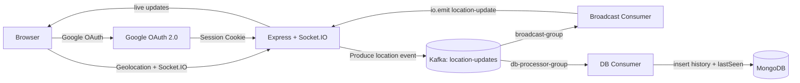

<p align="center">
  
</p>

<h1 align="center">Live Location Tracker</h1>

<p align="center">
  A premium, real-time location sharing application built with Node.js, Socket.IO, Kafka, and MongoDB.
</p>

<p align="center">
  
  
  
  
  
  
  
</p>

## Overview

Live Location Tracker lets authenticated users share their browser GPS position and see everyone move live on a dark interactive map. Location events are published to Kafka, then consumed independently for real-time broadcasting and MongoDB persistence.

The app runs as a single-origin Express server at `http://localhost:3000`: Express serves the frontend, handles Google OAuth sessions, exposes Socket.IO, and starts the Kafka consumers.

## Features

- Google OAuth 2.0 login with Passport.js.
- Session storage in MongoDB using `connect-mongo`.
- Real-time browser updates with Socket.IO.
- Kafka topic `location-updates` for durable event flow.
- Separate Kafka consumer groups for broadcasting and database writes.
- MongoDB location history with user `lastSeen` updates.
- Leaflet + CartoDB Dark Matter map tiles.
- Share location button, live marker updates, user sidebar, and responsive UI.
- Local Docker Compose for Kafka in KRaft mode and MongoDB.

## Architecture



## Project Structure

```text
Live Location Tracker/
├── docker-compose.yml
├── backend/
│   ├── package.json
│   ├── .env.example
│   └── src/
│       ├── server.js
│       ├── config/
│       ├── consumers/
│       ├── models/
│       ├── routes/
│       └── socket/
└── frontend/
    ├── index.html
    ├── css/style.css
    └── js/
        ├── app.js
        ├── auth.js
        ├── map.js
        └── socket.js
```

## Prerequisites

- Node.js 18 or newer
- Docker and Docker Compose
- Google Cloud OAuth 2.0 credentials

## Local Setup

1. Start MongoDB and Kafka:

```bash
docker compose up -d
```

2. Install backend dependencies:

```bash
cd backend
npm install
```

3. Create your environment file:

```bash
cp .env.example .env
```

4. Fill in `backend/.env` with your Google credentials:

```env
GOOGLE_CLIENT_ID=your_google_client_id_here
GOOGLE_CLIENT_SECRET=your_google_client_secret_here
SESSION_SECRET=replace_with_a_long_random_secret
MONGODB_URI=mongodb://localhost:27018/location-tracker
KAFKA_BROKER=localhost:9092
PORT=3000
```

5. In Google Cloud Console, add this authorized redirect URI:

```text
http://localhost:3000/auth/google/callback
```

6. Start the app:

```bash
npm run dev
```

7. Open:

```text
http://localhost:3000
```

Do not open the app through Live Server on `localhost:5500`; auth and Socket.IO routes only exist on the Express server.

## Environment Variables

| Variable | Required | Description |
| --- | --- | --- |
| `GOOGLE_CLIENT_ID` | Yes | Google OAuth client ID |
| `GOOGLE_CLIENT_SECRET` | Yes | Google OAuth client secret |
| `SESSION_SECRET` | Yes | Secret used to sign session cookies |
| `MONGODB_URI` | Yes | MongoDB connection string |
| `KAFKA_BROKER` | Yes | Kafka broker address |
| `PORT` | Yes | Express server port |
| `CLIENT_URL` | No | Only needed if serving frontend from a separate origin |

## Available Scripts

Run these from `backend/`.

```bash
npm run dev     # start with Node watch mode
npm start       # start normally
```

## Deployment

This project is not a static-only app. It needs a Node server, WebSockets, MongoDB, Kafka, and HTTPS.

Recommended managed setup:

- Render for the Node/Express + Socket.IO app.
- MongoDB Atlas for MongoDB.
- Confluent Cloud for Kafka.

For a simpler all-in-one deployment, use a VPS and run the app with Docker, plus a reverse proxy such as Caddy or Nginx for HTTPS.

Important production notes:

- Browser geolocation requires HTTPS outside `localhost`.
- Update Google OAuth redirect URI to your production URL, for example:

```text
https://your-domain.com/auth/google/callback
```

- Set production environment variables in your hosting provider.
- Use managed MongoDB/Kafka credentials instead of local Docker URLs.

## Troubleshooting

| Problem | Fix |
| --- | --- |
| `/auth/google` returns 404 | Open `http://localhost:3000`, not `localhost:5500` |
| Socket status stays `Reconnecting...` | Check your internet connection or if the server is down. |
| Socket status shows `Connection failed` | Authentication error. Try logging in again to refresh your session. |
| Location does not show | Click `Share location` and allow browser permission |
| Browser blocks geolocation after deploy | Use HTTPS |
| Server fails on MongoDB | Check `MONGODB_URI` and ensure Docker/Atlas is reachable |
| Server fails on Kafka | Check `KAFKA_BROKER` and ensure Kafka is healthy |

## License

MIT
