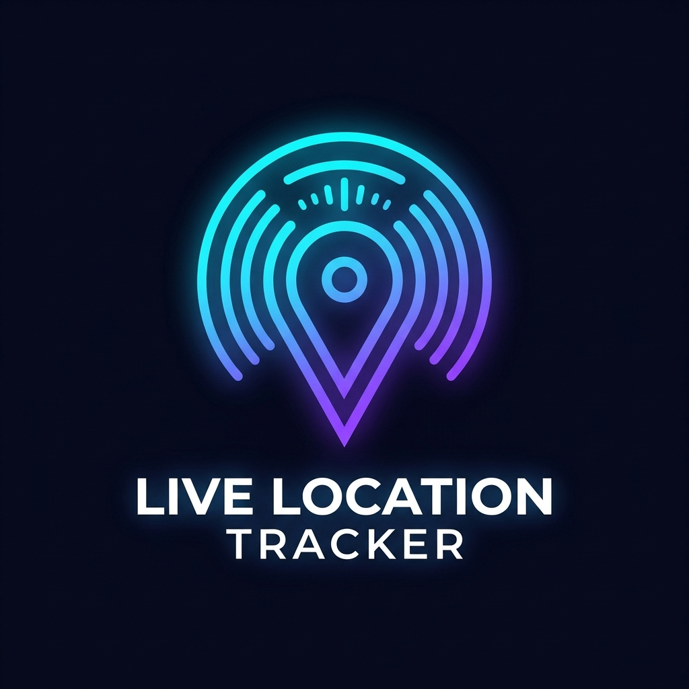
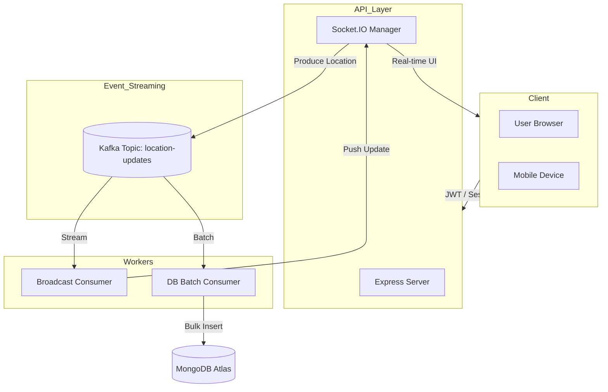

<p align="center">
  
</p>

<h1 align="center">Live Location Tracker</h1>

<p align="center">
  <b>A premium, real-time location sharing ecosystem built for high performance and scalability.</b>
</p>

<p align="center">
  
  
  
  
  
  
</p>

---

## 🚀 Overview

Live Location Tracker is a state-of-the-art real-time application that allows users to share their live GPS positions on an interactive, high-fidelity map. Built with a focus on modern aesthetics and distributed system principles, it leverages **Apache Kafka** to handle high-throughput location events, ensuring that the system remains responsive even with hundreds of concurrent users.

### Why Kafka?
Unlike traditional real-time apps that write to a database on every event (O(n) writes), this app uses Kafka to decouple the data flow:
1. **Real-time Path**: Events are consumed by a broadcast worker and pushed to clients immediately via WebSockets.
2. **Persistent Path**: A separate worker batches events and writes them to MongoDB in bulk, significantly reducing DB load.

---

## ✨ Features

- **🔐 Dual-Mode Authentication**: Seamlessly supports both **Google OAuth 2.0** sessions and **JWT-based** authentication for cross-domain and mobile compatibility.
- **🛰️ High-Precision Tracking**: Uses browser Geolocation API with high-accuracy settings for precise movement.
- **🗺️ Premium Dark Interface**: A sleek, glassmorphic UI built with Vanilla CSS and Leaflet.js, featuring CartoDB Dark Matter tiles.
- **🛣️ OSRM Multi-Profile Routing**: Calculates turn-by-turn routing with free, unlimited OSRM profiles for Driving, Walking, and Cycling.
- **🔍 Smart Autocomplete & Viewbox Bias**: Instant place suggestions container beneath directions inputs, localized via Leaflet bounding box biasing (`viewbox`) and restricted to India (`countrycodes=in`).
- **💡 Robust Geocode Fallback Parser**: Automatically strips building/house prefixes and cleans common road suffixes (e.g. `rd`, `road`, `st`, `street`) to resolve OpenStreetMap Nominatim's strict keyword index mismatching.
- **🔄 Dynamic Auto-Re-routing**: Tracks GPS coordinates dynamically. If a route starting point is `"Your location"`, the app automatically recalculates and redraws the path whenever you travel more than **15 meters**.
- **🎨 Lucide-Style SVG Icons**: Legacy emojis and low-fidelity unicode characters upgraded to clean, responsive inline SVGs with smooth CSS transitions and hover states.
- **👥 Intelligent Multi-Session Support**: Refactored socket logic allows users to be logged in from multiple tabs or devices simultaneously without session clashing.
- **⚡ Event-Driven Architecture**: Powered by Apache Kafka (KRaft mode) for professional-grade event streaming.
- **💾 Batch Persistence**: Efficient MongoDB write-buffering via dedicated Kafka consumers.
- **📱 Fully Responsive**: Realignment of all sidebars, search containers, status bars, and floating headers. Optimized for desktop and mobile navigation.

---

## 🛠️ Tech Stack

- **Frontend**: HTML5, Vanilla CSS (Glassmorphism), JavaScript (ESM)
- **Maps & Routing**: Leaflet.js, CartoDB Tiles, OSRM (Open Source Routing Machine), OSM Nominatim Geocoding
- **Backend**: Node.js, Express
- **Real-time**: Socket.IO 4.x
- **Messaging**: Apache Kafka (kafkajs)
- **Database**: MongoDB (Mongoose)
- **Auth**: Passport.js, JWT (jsonwebtoken)
- **Deployment**: Render (Backend), Vercel (Frontend), MongoDB Atlas, Confluent/Upstash Kafka

---

## 📐 Architecture



---

## 🏁 Getting Started

### Prerequisites
- Node.js 18+
- Docker & Docker Compose (for local Kafka/Mongo)
- Google Cloud Project with OAuth 2.0 Credentials

### Installation

1. **Clone & Setup Infrastructure**:
   ```bash
   docker compose up -d
   ```

2. **Install Backend Dependencies**:
   ```bash
   cd backend
   npm install
   ```

3. **Configure Environment**:
   Create a `.env` file in the `backend` directory:
   ```env
   GOOGLE_CLIENT_ID=your_id
   GOOGLE_CLIENT_SECRET=your_secret
   SESSION_SECRET=your_random_secret
   MONGODB_URI=mongodb://localhost:27018/location-tracker
   KAFKA_BROKER=localhost:9092
   PORT=3000
   ```

4. **Run the App**:
   ```bash
   npm run dev
   ```

---

## 🛠️ Troubleshooting

| Issue | Potential Solution |
| --- | --- |
| **"Connection failed"** | Your JWT or Session has expired. Try logging out and signing in with Google again. |
| **"Reconnecting..."** | The backend server is unreachable. Check if the Node process or Render service is active. |
| **Map is blank** | Ensure you have an active internet connection to load Leaflet tiles. |
| **Location not moving** | Make sure you've clicked **"Share Location"** and granted browser permissions. |
| **Kafka errors** | Ensure Docker is running or your Kafka broker address is correct. |

---

## 📜 License

This project is licensed under the MIT License - see the [LICENSE](LICENSE) file for details.

---

<p align="center">
  Built with ❤️ for the Developer Cohort
</p>
